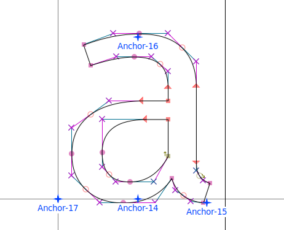
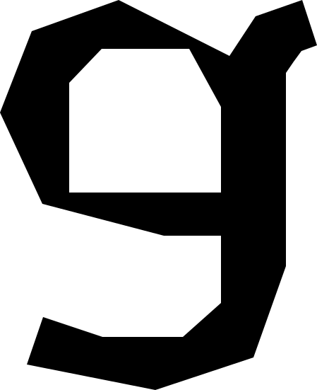
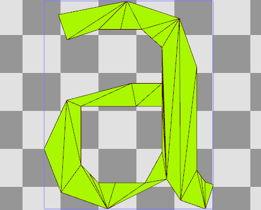
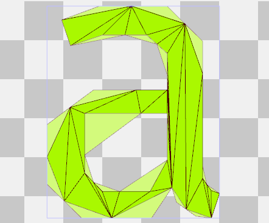
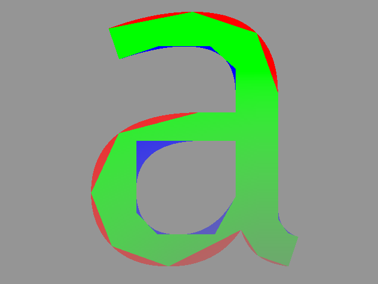

# Resizable Label
One of the more interesting demos in the gkurve example is the Resizable Label. It takes a point and curve data from font glyphs and turnes them into scalable gkurve triangles.

The first part of the process is getting all the font point data using `Freetype`.  Only `moveTo`, `lineTo` and `conicTo` instructions are payed attention to.

Taking the raw points, including some control points (marked with `x` in fontforge above) that are inside the font outline, and creating a polygon out of them.

The polygon is upside down here. This is good because the gpu usually takes inverted y coordinates. But for sake of visualization here's that polygon flipped.

This polygon is then triangulated using a tesselater (I used `libtess2`). The tesselater gives back a array of indecies to the original polygon for the generated mesh which is used for mapping the curves back on.

Then all the curves are mapped back onto the mesh with their control points as one of the verticies.

When rendered by the gkurve renderer you will something like:

Shown in the image is a debug render where the red pieces are the convex curves while the blue are concave curves. _Note: you can see the concave control points but not the convex because they are made invisible by the renederer._
